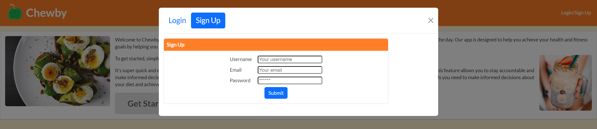
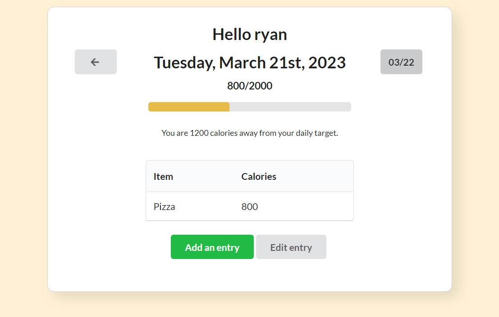
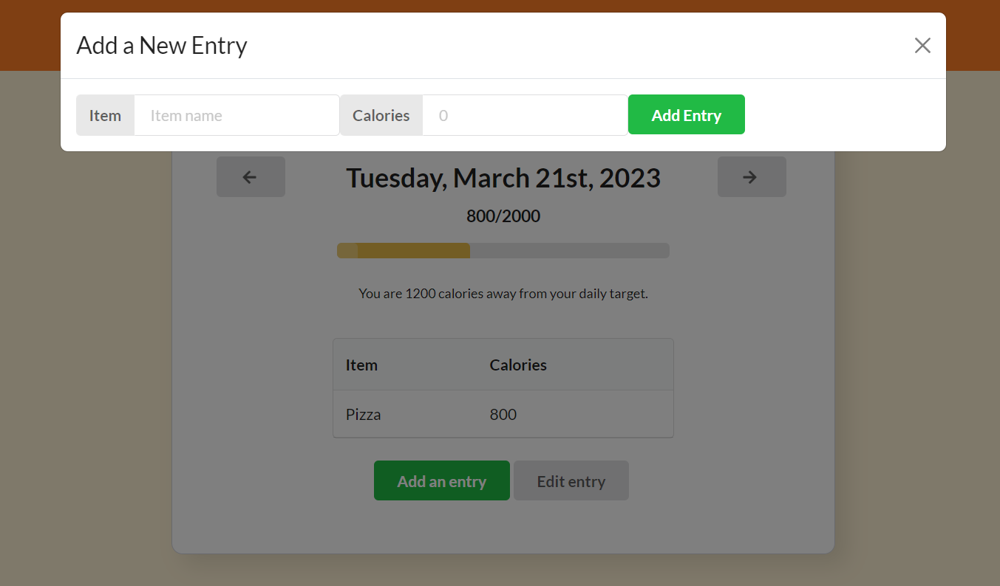

# Project-3

## Description

Welcome to Chewby, a calorie tracking application! With our user-friendly interface, you can easily track the calories you consume and burn throughout the day. Our app is designed to help you achieve your health and fitness goals by helping you keep track of the calories you eat throughout the day. The motivation for this project was to explore the MERN Stack and build a Full Stack Application that we could use in our daily lives. By building this proejct we learned how to better configure a MongoDB database, how to use the Apollo Server and GraphQL APIs for querying our database, and how to develop a front end React application.

## Table of Contents

- [Installation](#installation)
- [Usage](#usage)
- [License](#license)
- [Contributing](contributing)
- [Questions](#questions)

## Installation

Run the command 'npm i' while in the root project directory. This will install the required serverside and clientside node package modules.  

After installing the required node packages, run 'npm run build' to create the React build directory.

Lastly the command 'npm run develop' will concurrently run both the server and client applications. If running the application locally, the server listens on port 3001, and the client can be accessed on port 3000.

## Usage

To use the application, if you ran 'npm run develop', then the client application should open automatically in your web browser. Otherwise, if running locally, navigate to localhost:3000 in your browser. In the home '/' route, the user is presented with our landing page. The Nav Bar and 'Get Started' buttons can be used to log in or create a new account.

Once logged in, the user is presented with the UserHome page. On this page the user can see their entry log. The page includes button for adding, removing, and updating entries, along with buttons for navigating between different days. 

When using the user interface buttons to add, delete, and remove entries, a Modal is presented that includes the respective entry form.

## License

n/a

## Contributing

n/a

## Questions

An example run of the application and server is deployed on [Heroku](https://chewby.herokuapp.com/).

If you have any questions about the repo, open an issue or contact us directly at ryanfernandez11@gmail.com. 
You can find more of our work through our GitHub pages: [ryanafernandez](https://github.com/ryanafernandez/), [eddygoto](https://github.com/eddygoto), [linhklatt](https://github.com/linhklatt), [tbberhe](https://github.com/tbberhe).